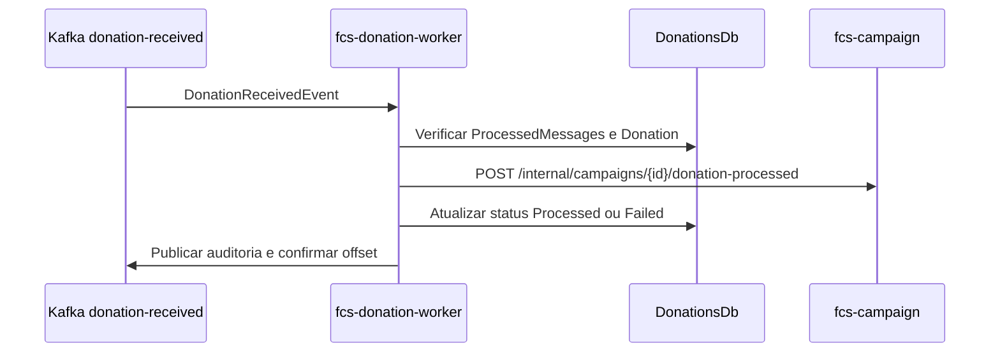

# fcs-donation-worker

Worker de processamento assíncrono de doações da plataforma Conexão Solidária. Consome eventos `DonationReceivedEvent` publicados no Kafka pela `fcs-donations`, atualiza o status da doação no `DonationsDb` e notifica a `fcs-campaign` por API interna para refletir o valor arrecadado.

> Microsserviço que compõe o MVP da Conexão Solidária junto a `fcs-identity`, `fcs-campaign`, `fcs-donations`, `fcs-audit-logs`, `fcs-web` e `fcs-infra`.

---

## Responsabilidades

- Consumir eventos `DonationReceivedEvent` do tópico Kafka `donation-received`.
- Garantir idempotência por `eventId + topic` usando `ProcessedMessages`.
- Ler e atualizar doações no `DonationsDb`.
- Atualizar a doação para `Processed` ou `Failed`.
- Preencher `FailureReason` quando a doação falhar.
- Chamar a API interna da `fcs-campaign` para registrar doação processada.
- Publicar eventos explícitos de auditoria quando houver processamento, falha ou duplicidade.
- Expor apenas endpoints operacionais `/health` e `/metrics` quando configurados no ambiente de execução.

O `fcs-donation-worker` não possui endpoints HTTP de negócio e não escreve diretamente no banco da `fcs-campaign`.

Documentação completa da arquitetura: [group10-tc-01/fcs-fase05-docs](https://github.com/group10-tc-01/fcs-fase05-docs).

Referências diretas:

- [Visão geral da arquitetura](https://github.com/group10-tc-01/fcs-fase05-docs/blob/main/architecture/overview.md)
- [Fluxo da fcs-donations](https://github.com/group10-tc-01/fcs-fase05-docs/blob/main/architecture/fcs-donations-model.md)
- [Modelo de banco de dados](https://github.com/group10-tc-01/fcs-fase05-docs/blob/main/architecture/database-model.md)
- [Fluxos dos endpoints e workers](https://github.com/group10-tc-01/fcs-fase05-docs/blob/main/architecture/endpoint-flows.md)

ADRs relevantes:

- [ADR 0008 - Kafka para eventos de doação](https://github.com/group10-tc-01/fcs-fase05-docs/blob/main/adr/0008-use-kafka-for-donation-events.md)
- [ADR 0009 - Worker atualiza status da doação](https://github.com/group10-tc-01/fcs-fase05-docs/blob/main/adr/0009-worker-updates-donation-status.md)
- [ADR 0010 - Worker atualiza campanhas por API interna](https://github.com/group10-tc-01/fcs-fase05-docs/blob/main/adr/0010-worker-updates-campaigns-through-internal-api.md)
- [ADR 0014 - Kafka dentro do Kubernetes](https://github.com/group10-tc-01/fcs-fase05-docs/blob/main/adr/0014-run-kafka-inside-kubernetes.md)
- [ADR 0018 - Reuso do fcs-pipelines](https://github.com/group10-tc-01/fcs-fase05-docs/blob/main/adr/0018-reuse-fcs-pipelines-for-ci-cd.md)
- [ADR 0019 - Estrutura interna .NET da fase 04](https://github.com/group10-tc-01/fcs-fase05-docs/blob/main/adr/0019-use-phase-04-dotnet-service-structure.md)

---

## Fluxo de processamento



Regras importantes:

- A `fcs-donations` publica `DonationReceivedEvent` via outbox.
- O worker registra mensagens tratadas em estado terminal em `ProcessedMessages` para ignorar redeliveries.
- Duplicidade deve ser tratada como sucesso operacional e não deve chamar campanhas novamente.
- A atualização da campanha sempre passa pela API interna da `fcs-campaign`.
- O offset Kafka só deve ser confirmado após processamento de negócio bem-sucedido, duplicidade idempotente ou falha controlada registrada.

---

## Contrato Kafka

Tópico:

```text
donation-received
```

Evento:

```text
DonationReceivedEvent
```

Payload mínimo:

```json
{
  "eventId": "3c03f6e3-7c8d-43b8-8f94-4c4ef3b6b4e6",
  "donationId": "11111111-1111-1111-1111-111111111111",
  "campaignId": "22222222-2222-2222-2222-222222222222",
  "donorId": "33333333-3333-3333-3333-333333333333",
  "amount": 100.00,
  "occurredAt": "2026-05-18T20:00:00Z"
}
```

Campos obrigatórios:

| Campo | Descrição |
|-------|-----------|
| `eventId` | Identificador único usado para idempotência |
| `donationId` | Doação criada pela `fcs-donations` |
| `campaignId` | Campanha que receberá a doação |
| `donorId` | Perfil do doador sem foreign key para `IdentityDb` |
| `amount` | Valor da doação |
| `occurredAt` | Data/hora UTC do evento original |

---

## Integração interna

Chamada esperada para campanhas:

```text
POST /api/v1/internal/campaigns/{id}/donation-processed
```

Payload:

```json
{
  "donationId": "11111111-1111-1111-1111-111111111111",
  "amount": 100.00,
  "processedAt": "2026-05-18T20:00:00Z"
}
```

---

## Estrutura do projeto

```text
src/
  Fcs.Donation.Worker.Application/    # Consumers Kafka, idempotência e serviços de processamento
    Common/
    Features/
  Fcs.Donation.Worker.Worker/         # Host .NET Worker, configuração e Dockerfile
tests/
  Fcs.Donation.Worker.UnitTests/
```

Estrutura interna alinhada ao padrão da fase 04 ([ADR 0019](https://github.com/group10-tc-01/fcs-fase05-docs/blob/main/adr/0019-use-phase-04-dotnet-service-structure.md)).

---

## Persistência

- Engine: SQL Server.
- Database: `DonationsDb`.
- Tabelas usadas pelo worker:
  - `Donations`
  - `ProcessedMessages`

O worker não cria foreign keys para bancos de outros serviços.

`ProcessedMessages` registra o `eventId + topic` quando a mensagem chega a um resultado terminal: sucesso, doação inexistente, doação fora de `Pending` ou falha controlada após tentativas de refletir a doação na `fcs-campaign`.

Eventos de auditoria esperados:

- `DonationProcessed`
- `DonationFailed`
- `DuplicateMessageIgnored`

---

## Pré-requisitos

- [.NET 10 SDK](https://dotnet.microsoft.com/download)
- [Docker](https://docs.docker.com/get-docker/) e Docker Compose
- Portas livres no host: `1433` (SQL Server), `9092` (Kafka), `8081` (Kafka UI), `5341` (Seq).

---

## Subindo o ambiente local

O `docker-compose.yml` deste repositório sobe apenas as dependências deste worker (SQL Server, Kafka, Kafka UI e Seq) e, opcionalmente, o próprio worker. Para o ambiente completo integrado da Conexão Solidária, utilize o repositório `fcs-infra`.

### 1. Subir dependências

```bash
docker compose up -d sqlserver zookeeper kafka kafka-ui seq
```

URLs úteis:

- Kafka UI: http://localhost:8081
- Seq: http://localhost:5341
- SQL Server: `Server=localhost,1433;Database=DonationsDb;User Id=sa;Password=Your_password123;TrustServerCertificate=True`

### 2. Rodar o worker localmente

```bash
dotnet restore
dotnet build
dotnet run --project src/Fcs.Donation.Worker.Worker
```

### 2b. Rodar o worker também em contêiner

```bash
docker compose up -d --build fcs-donation-worker
```

### 3. Publicar evento manual para teste

```bash
docker exec -i kafka-fcs-donation-worker kafka-console-producer \
  --bootstrap-server kafka:29092 \
  --topic donation-received
```

Payload de exemplo:

```json
{"eventId":"11111111-1111-1111-1111-111111111111","donationId":"22222222-2222-2222-2222-222222222222","campaignId":"33333333-3333-3333-3333-333333333333","donorId":"44444444-4444-4444-4444-444444444444","amount":100.00,"occurredAt":"2026-05-18T20:00:00Z"}
```

---

## Testes

```bash
# Todos os testes
dotnet test

# Projeto de testes unitários
dotnet test tests/Fcs.Donation.Worker.UnitTests
```

Cobertura mínima exigida pela esteira: **80%** ([ADR 0021](https://github.com/group10-tc-01/fcs-fase05-docs/blob/main/adr/0021-test-strategy-for-apis-and-worker.md)).

---

## Observabilidade

- Logs estruturados com **Serilog** enviados ao **Seq** em ambiente local.
- Consumo Kafka com logs de duplicidade, falha de processamento e retry por não commit de offset.
- Endpoints operacionais esperados no ambiente de execução:
  - `/health`
  - `/metrics`

O worker não expõe endpoints de negócio; sua comunicação operacional segue a [visão geral da arquitetura](https://github.com/group10-tc-01/fcs-fase05-docs/blob/main/architecture/overview.md).

---

## CI/CD

A esteira fica em `.github/workflows/` reutilizando os workflows reutilizáveis do repositório `fcs-pipelines` ([ADR 0018](https://github.com/group10-tc-01/fcs-fase05-docs/blob/main/adr/0018-reuse-fcs-pipelines-for-ci-cd.md)):

- `branch-name-check.yml` - política de nomes de branch
- `dotnet-service-ci.yml` - build .NET, testes, SonarCloud, Trivy e validações do serviço

Gates principais: secret scan (Gitleaks), dependency scan, restore/build, testes com cobertura mínima de 80%, SonarCloud opcional e regras de proteção por branch.

---

## Kubernetes

Manifests Kubernetes deste worker (Deployment, Service, ConfigMap, Secret) ficam no repositório `fcs-infra`, junto ao ambiente integrado VPS/K3s.

Namespace alvo: `fcs-donation-worker`.

---

## Como este worker atende ao hackathon

| Requisito do hackathon | Onde é atendido |
|------------------------|-----------------|
| Microsserviço distinto | `fcs-donation-worker` separado das APIs de negócio |
| Mensageria assíncrona | Consumo do tópico Kafka `donation-received` |
| Processamento em background | Worker .NET para fechar o fluxo de doações |
| Observabilidade | Logs estruturados, `/health` e `/metrics` |
| Imagem Docker e pipeline | `Dockerfile`, `docker-compose.yml` e workflows em `.github/workflows` |

O `fcs-donation-worker` fecha o fluxo assíncrono entre intenção de doação, processamento, atualização de status e reflexo do valor arrecadado na campanha.
